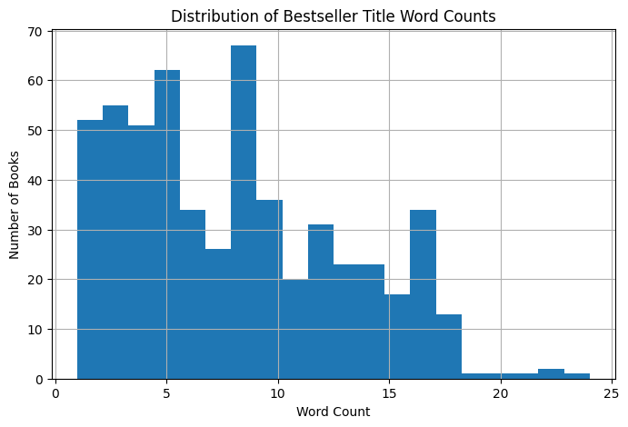
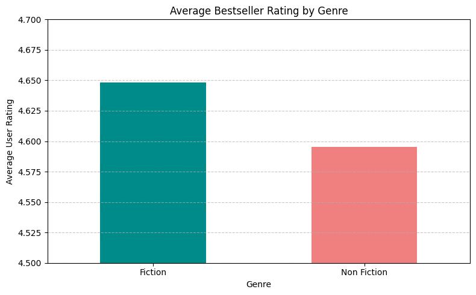
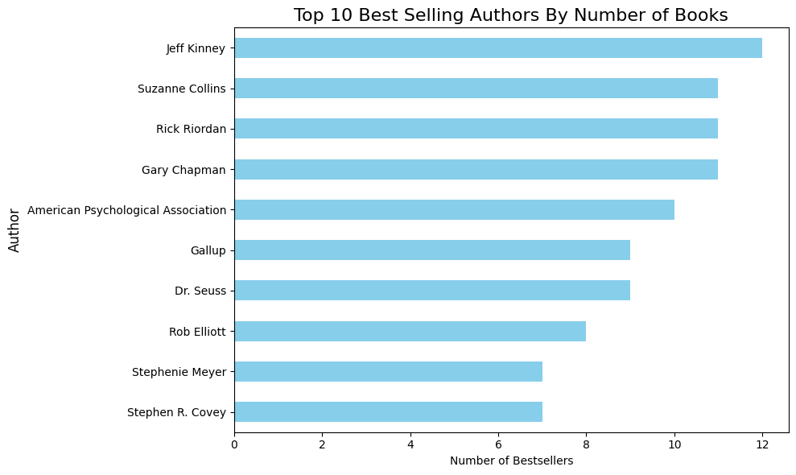

# Best Selling Book Predictors

This project explores a dataset of 550 bestselling books and applies simple machine learning models to predict Goodreads-style ratings. The focus is on **Linear Regression** and **Random Forest Regressor** as baseline models.

---

## Project Structure
- **data/** — dataset (`bestsellers.csv`, small file so kept in repo)  
- **figures/** — saved plots generated from the notebook  
- **notebooks/** — Jupyter notebooks for analysis (`predictor.ipynb`)  
- **requirements.txt** — dependencies  
- **.gitignore** — ignore venvs, caches, etc.  

---

## Quickstart
### 1. Clone the repo
git clone https://github.com/JVP7/predictor.git  
cd predictor  

### 2. (Optional) create a virtual environment
python -m venv .venv  
source .venv/bin/activate   # Windows: .venv\Scripts\activate  

### 3. Install dependencies
pip install -r requirements.txt  

### 4. Run the notebook
jupyter notebook notebooks/predictor.ipynb  

---

## Dataset
- **File:** `data/bestsellers.csv` (550 rows)  
- **Columns:** Title, Author, Rating, Reviews, Price, Publication Year, Genre

---

## Results
| Model             | R² (test) | MSE (test) |
|-------------------|-----------|------------|
| Linear Regression | ~0.0815   | ~0.0527    |

> Ratings are tightly clustered (≈4.5–4.7), so high R² is not expected with these features.  
> Future work may involve adding non-linear models and cross-validation.

---

## Figures
### Distribution of Title Word Counts

### Average Bestseller Rating by Genre

### Top Selling Authors by Number of Books

---

## License
MIT (add a LICENSE file if you want)
